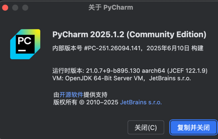

# HarmonyTest 项目

## 项目简介

HarmonyTest 是一个用于自动化测试的项目，支持对鸿蒙应用或相关小程序进行批量用例执行、截图识别与报告生成。项目包含 Python 脚本、配置文件和测试用例，便于扩展和自定义。

华为官方 Hypium 文档：  
https://developer.huawei.com/consumer/cn/doc/harmonyos-guides/hypium-python-guidelines

PyCharm 建议安装社区版本:



## 主要目录结构

```text
├── aw/           # 公共工具方法（如用例收集、截图识别等）
├── conf/         # 配置文件（如 testcases.conf）
├── config/       # 其他配置（如用户配置）
├── reports/      # 测试报告及截图输出目录
├── resource/     # 资源文件
├── testcases/    # 测试用例目录
├── utils/        # 工具类（如 OCR、配置解析等）
├── main.py       # 主程序入口
├── package.json  # Node 依赖（如 hypium）
```

---

## 测试用例配置文件

- `conf/testcases.conf`：测试用例配置文件，需要测试哪些用例，在这个文件上配置。如不需要执行，注释即可。

---

## 图片转文字和坐标的方法

除了官方给出的定位方法，还封装了图片转文字和坐标的方法，调用方式如下：

**判断文本内容是否存在的例子：**

```python
result = find_text_in_screen(self.driver, "bbb")
host.check_equal(result['isExits'], False, "点击view出现点击态")
```

**判断文本内容是否存在，并点击坐标的例子：**

```python
result = find_text_in_screen(self.driver, "打开小程序", langlang='ch') #默认 lang = en
startAppletComponent = result['target_coords']
self.driver.touch(startAppletComponent)
```

---

## 打开 APP 并输入小程序参数

提供封装了方法 `init_app`，作用是打开 APP，并输入需要打开小程序的 appid、path、query。调用例子：

```python
self.hypiumUtil = driver_util(self.driver)
self.hypiumUtil.init_app( "/pages/component/view/view?case=row")
```

- `appid`：可以不传，默认打开示例小程序 
- `pathAndQuery`：是必填项，格式为 path 拼接 query，例如：`/pages/component/view/view?case=row`
- `startApplet`：可以不传，默认需要打开小程序。传False则只启动APP不打开小程序


---

## 新增测试用例-快捷方法
1. 在 `conf/testcases.conf` 文件添加用例标题。例如：

    ```ini
    [view]
    view= "view组件的用例"
    ```
2. 根目录下有个 createCase.py 文件，修改 testCasePath 变量,例如：testCasePath = "view/view_column"
3. 执行 createCase.py 文件,执行成功后，就会创建一条空用例。

## 新增测试用例-常规方法
1. 在 `conf/testcases.conf` 文件添加用例标题。例如：

    ```ini
    [view]
    view= "view组件的用例"
    ```

2. 在 `testcases` 目录下，添加用例模块。例如：`testcases/view/view/view.py`
3. 每个用例文件夹下，必须包含和用例同名的 json 文件，例如：`testcases/view/view/view.json`
4. json 文件下，需要注明当前用例的 py 文件路径，例如：

    ```json
    {
      "description": "Config for MeeTimeTest",
      "environment": [
        {
          "type": "device",
          "label": "phone"
        }
      ],
      "driver": {
        "type": "DeviceTest",
        "py_file": [
          "view/view/view.py"
        ]
      }
    }
    ```

5. py 文件的类名，必须和用例名称一致；  
   **ps:** 直接的方法是复制现有的用例，然后直接改文件夹名称、用例名称、类名、json 文件指定 py 路径。

---

## 用例调试

- **调试单条步骤**：使用 PyCharm 可以直接连手机投屏，并且支持选中代码直接运行。
- **调试整个用例**：在 `conf/testcases.conf` 上，只打开需要测试的用例，然后执行 `main.py` 测试。

---

## 测试报告查看

通过浏览器打开项目目录下的  
`/reports/harmonyReports/summary_report.html`  
即可查看测试报告。

---
